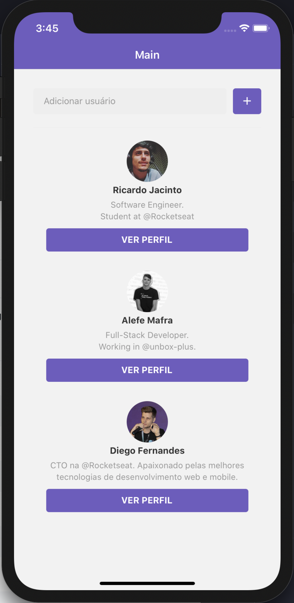
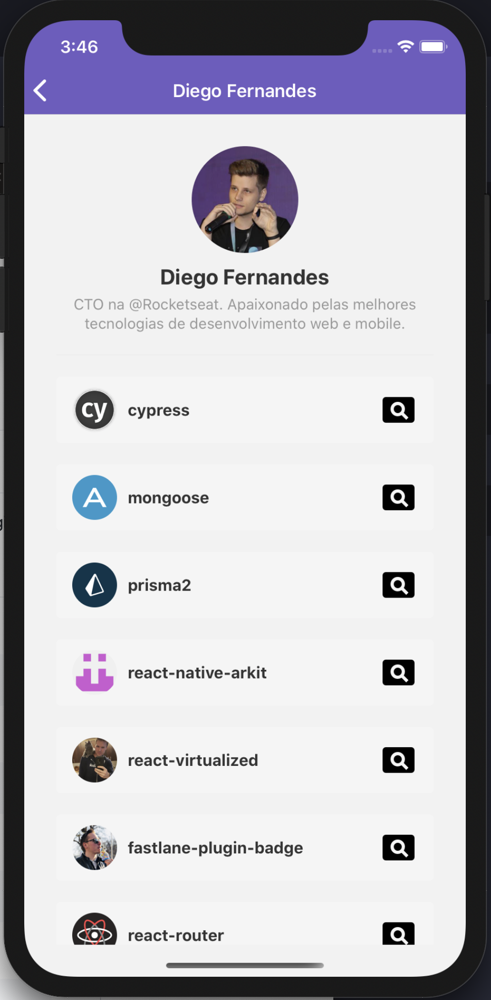
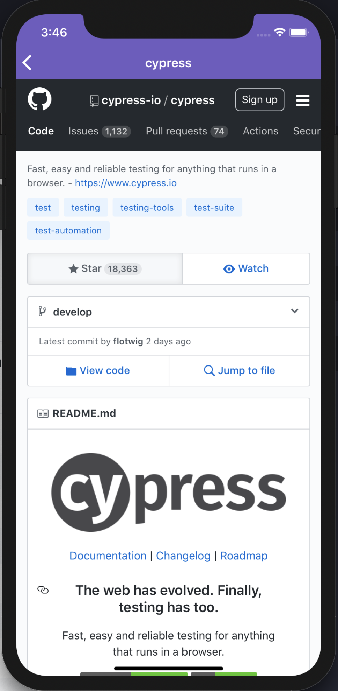

# Desafio 06: Primeiro Projeto com React Native

<h1 align="center">
    
</h1>

## About

A simple react native app to add users to a list saved on local storage and see user starred repos, with option to open repo in webview.

## Installation

Clone the project with

```sh
git clone https://github.com/cadohr/rocketseat-bootcamp-desafio06.git
```

Get in the project path

```sh
cd rocketseat-bootcamp-desafio06
```

Then install the dependencies with:

```sh
yarn
```

Start application with:

```sh
react-native run-ios || react-native run-android
```

## Screenshot




